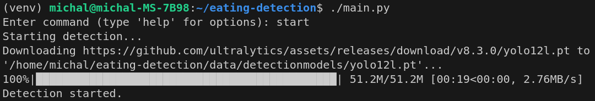
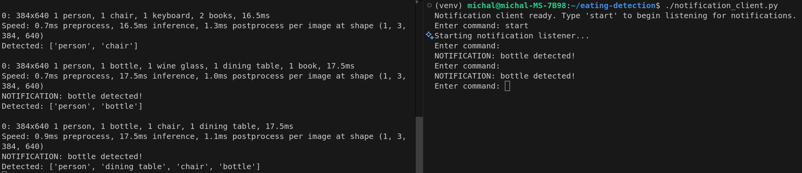

# Eating Detection

This project detects selected objects (e.g., bottles) in camera images, notify user when certain object is detected and provides a command-line interface for configuration and control.

## Project Structure
```
eating-detection/
├── data/
│   ├── camera_replacement.jpg
│   ├── settings.json
│   └── detectionmodels/
│       └── yolo12l.pt
├── docs/
│   └── app_running.png
│   └── main_setup.py
├── src/
│   ├── __init__.py
│   ├── cmd_app.py
│   ├── food_detection_system.py
│   ├── notification_system.py
│   └── yolo.py
├── tests/
│   ├── test_CmdApp.py
│   ├── test_FoodDetectionSystem.py
│   ├── test_NotificationClient.py
│   ├── test_NotificationSystem.py
│   └── test_Yolo.py
├── .gitignore
├── LICENSE
├── main.py
├── notification_client.py
├── README.md
└── requirements.txt
```

## Step-by-step instructions

### 1. Install Python

Make sure you have Python 3.8 or newer installed.

### 2. Clone the repository

```bash
git clone git@github.com:Enlightened-Monkey/eating-detection.git
cd eating-detection
```

### 3. Install dependencies

Install required libraries using pip:

```bash
pip3 install -r requirements.txt
```

### 4. Run the notification client (optional)

To receive real-time notifications when a desired object is detected, you can run the notification client in a separate terminal.

```bash
./notification_client.py
```

When the main application detects an object from your `what_to_detect` list, it will send a notification to the client. For example:

```
NOTIFICATION: bottle detected
```

### 5. Run the main application

In another terminal, start the main program:

```bash
./main.py
```

### 6. Use the command-line interface

**Main Application Commands:**

- `help` – Show available commands
- `start` – Start object detection. After first run model file yolo12l.pt will be automatically dowloaded into src/detectionmodels/ 
- `stop` – Stop object detection
- `what_to_detect` – Set objects to detect (comma-separated)
- `threshold` – Set detection confidence threshold (0.0–1.0)
- `camera_settings` – Configure camera resolution and frame check interval
- `exit` – Exit the application

**Notification Client Commands:**

- `help` – Show available commands
- `start` – Start listening for notifications
- `stop` – Stop listening for notifications
- `exit` – Exit the notification client

### 7. Configuration

Settings are saved in `data/settings.json`. You can edit this file manually or use the CLI commands.

## Screenshots
*Main setup*

*App is running*


## Detectable objects by Yolo12l

The YOLOv12l model used in this project can detect the following 80 objects:
person, bicycle, car, motorcycle, airplane, bus, train, truck, boat, traffic light, fire hydrant, stop sign, parking meter, bench, bird, cat, dog, horse, sheep, cow, elephant, bear, zebra, giraffe, backpack, umbrella, handbag, tie, suitcase, frisbee, skis, snowboard, sports ball, kite, baseball bat, baseball glove, skateboard, surfboard, tennis racket, bottle, wine glass, cup, fork, knife, spoon, bowl, banana, apple, sandwich, orange, broccoli, carrot, hot dog, pizza, donut, cake, chair, couch, potted plant, bed, dining table, toilet, tv, laptop, mouse, remote, keyboard, cell phone, microwave, oven, toaster, sink, refrigerator, book, clock, vase, scissors, teddy bear, hair drier, toothbrush.

For more information, see the source code
